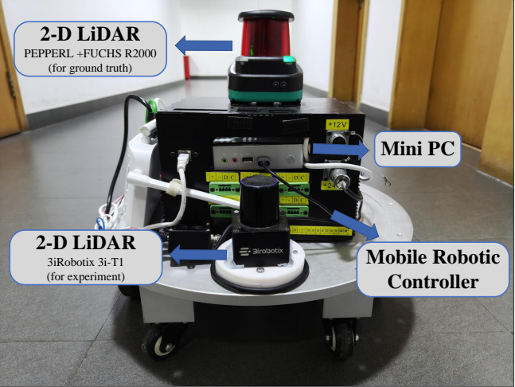
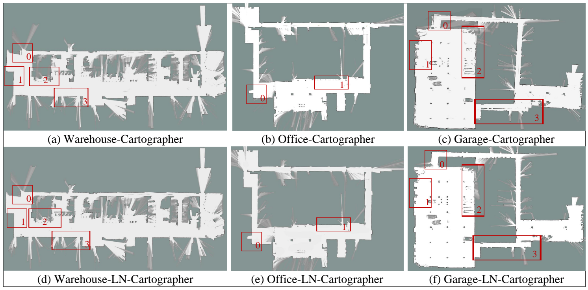

# LSW-Net: A Spatio-temporal Self-Supervised Framework for 2D LiDAR-Based Environment Perception

## Overview

## Experiment platform

## Mapping

## Result

### Point Cloud Registration 

| Algorithm         | Warehouse RTE/m | Warehouse RRE/rad | Office Building RTE/m | Office Building RRE/rad | Garage RTE/m | Garage RRE/rad |
|------------------|----------------|-------------------|----------------------|------------------------|-------------|--------------|
| ICP              | 2.256          | 0.047            | 1.144                | 0.029                  | 2.262       | 0.039        |
| PL-ICP           | 2.132          | 0.042            | 1.039                | 0.032                  | 2.035       | 0.041        |
| GICP             | 0.851          | 0.032            | 0.783                | **0.019**               | 0.63        | 0.017        |
| **LSWNet-ICP**   | **0.74**       | **0.025**        | **0.673**            | 0.021                  | **0.457**   | **0.013**    |

### Mapping

| Algorithm       | Warehouse ATE/m | Warehouse ARE/rad | Office Building ATE/m | Office Building ARE/rad | Garage ATE/m | Garage ARE/rad |
|---------------|----------------|------------------|----------------------|------------------------|-------------|--------------|
| Karto         | 0.481          | 0.338            | 0.467                | 1.932                   | 1.056       | 1.727        |
| **LN_Karto**  | **0.160**      | **0.316**        | **0.173**            | **1.908**               | **1.109**   | **1.714**    |
| Cartographer  | 0.229          | 0.082            | 0.203                | 0.017                   | 0.889       | 0.184        |
| **LN_Carto**  | **0.046**      | **0.079**        | **0.177**            | **0.014**               | **0.189**   | **0.101**    |

## Ablation
| Method            | Warehouse ATE/m | Warehouse ARE/rad | Office Building ATE/m | Office Building ARE/rad | Garage ATE/m | Garage ARE/rad |
|------------------|----------------|------------------|----------------------|------------------------|-------------|--------------|
| only \(L_{comp}\)  | 0.155          | 0.081            | 0.21                 | 0.014                   | 0.705       | 0.069        |
| only \(L_{guide}\) | 0.143          | 0.082            | 0.177                | 0.016                   | 0.36        | 0.122        |
| **LSWNet-Carto**  | **0.046**      | **0.079**        | **0.177**            | **0.014**               | **0.189**   | **0.101**    |
